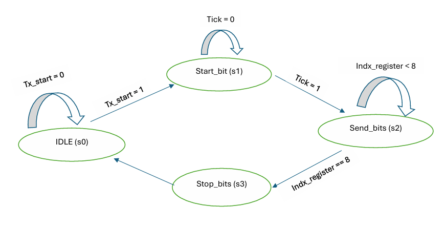
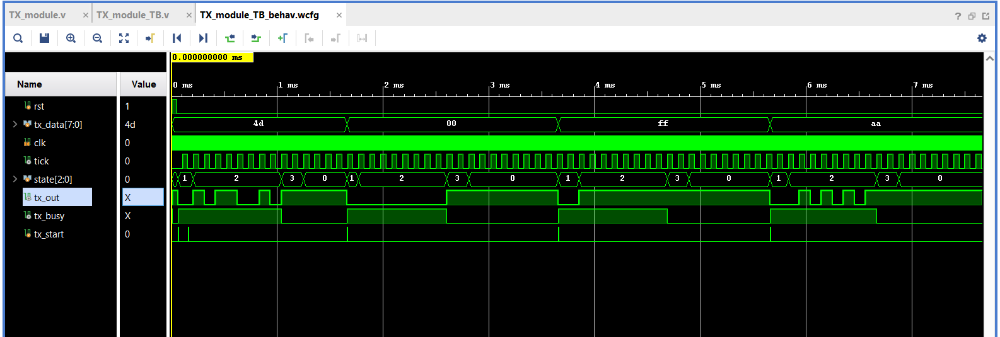

# UART Transmitter – Verilog Project

This project implements a **UART (Universal Asynchronous Receiver/Transmitter) Transmitter** in Verilog. It is designed for simulation and verification purposes, with a clear FSM-based implementation, baud rate control, and a self-checking testbench.

## Project Structure

UART_TX_project/
verilog_src/
-   TX_module.v          ----  # Main UART transmitter module
-   TX_module_TB.v       ----  # Testbench for the transmitter

## Features

- Verilog RTL implementation of UART transmitter  
- FSM-based transmission logic  
- Configurable baud rate via `tick` signal  
- Start bit, 8 data bits, and stop bit transmission  
- Testbench that simulates and verifies output behavior  
- Clean project structure and Git tracking  

## Transmission Protocol

- 1 start bit (LOW)  
- 8 data bits (LSB first)  
- 1 stop bit (HIGH)  

The module transmits serial data based on incoming parallel 8-bit input and `tx_start` signal. It uses a `tick` signal derived from a clock divider for baud rate control.

## FSM Diagram (UART TX logic)

FSM States:  
IDLE → START → DATA_0 → DATA_1 → ... → DATA_7 → STOP → IDLE

## Simulation

The project includes a testbench (`TX_module_TB.v`) that:  
- Sends data frames to the transmitter  
- Waits for `tx_done` to go high  
- Logs the serial output for waveform analysis  

You can simulate using tools like Vivado, ModelSim, or iverilog + GTKWave.

This waveform shows:
Several bytes transmitted: 0x4D, 0x00, 0xFF, 0xAA
The tx_start signal initiating transmission
Internal FSM state transitions
Serial bitstream generated on tx_out

This waveform shows UART transmission of multiple bytes and internal state transitions.

🧑‍💻 Author
Hady Sfady
Electronics Engineer specializing in Digital Design, Verification, and FPGA.
Passionate about RTL development and hands-on hardware projects.
